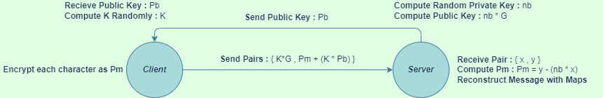
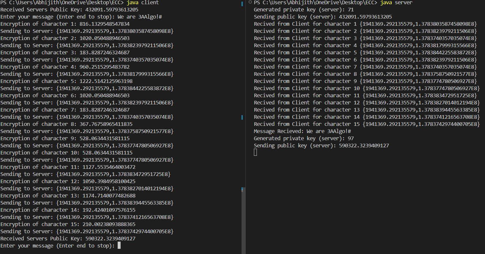

# ECC-Secure-Message-Transfer
Implemented Elliptic Curve Cryptography (ECC) for secure message transfers between a Client and Server Model in Java with socket programming. ECC is as one-way encryption of emails, data and software and a popular alternative to RSA Algorithm. The algorithm is implemented as a part of our internal assessment for our coursework
- - - -
### Parameters Used
>* ECC Equation : E(1,1) -> y^2 = x^3 + x + 1
>* G of order 333 = (333^2 + 333 + 1)^(1/2)
>* n value is 256 and na, nb generated randomly lesser than n
>* k value generated randomly between 1 and 1000
- - - -
### Working Block Diagram

- - - -
### Output

- - - -
### Authors
* [Abhijith Ajith](https://github.com/AAbhijithA)
* [Amoghavarsh SH](https://github.com/AsHtrich)
* [Aravind Krishnan](https://github.com/aravindk017)
